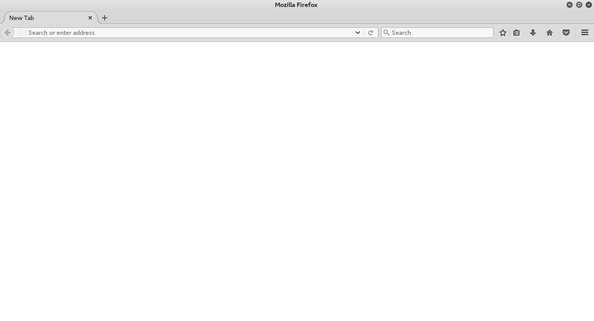
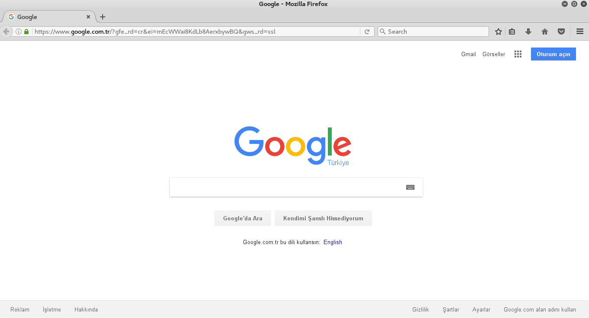
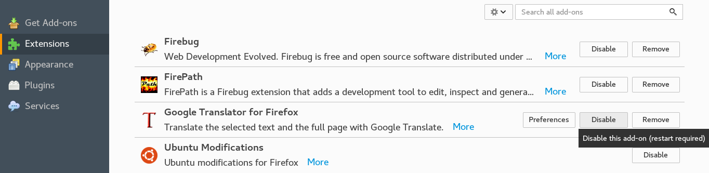
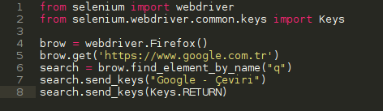
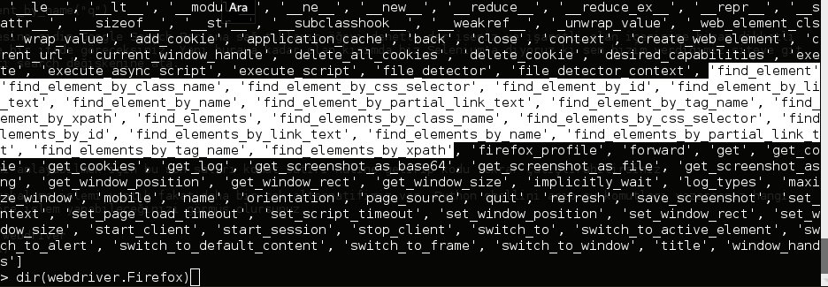
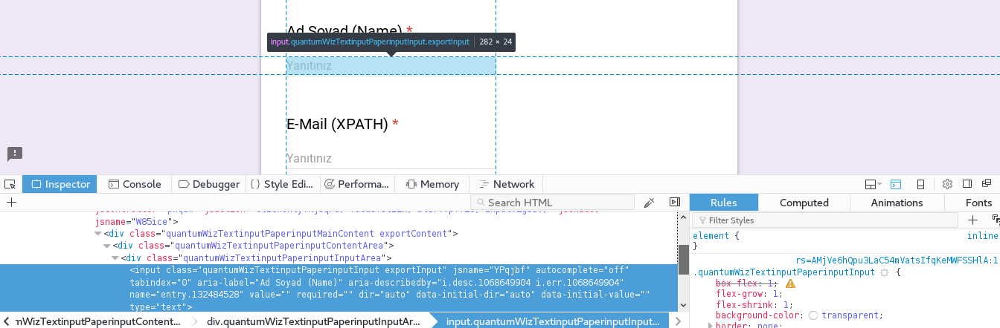
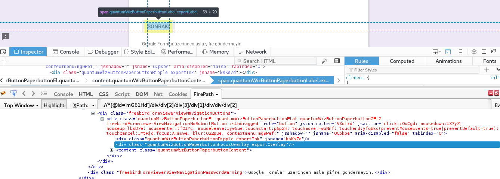

**Selenium**, webdriver kullanarak genellikle test otomasyonlarını otomatikleştirmeye yarayan bir API'dir. Selenium ile web sayfasında bir kullanıcının yapabileceği her şeyi otomatize hale getirebilirsiniz. Selenium her tarayıcıda çalışabilir. Selenium Python API kullanarak selenium web sürücüsünün tüm işlevlerine sezgisel bir şekilde ulaşabilirsiniz.

<h3>Selenium Kurulumu</h3>

Selenium kurulumunu **pip** ile yapmanızı tavsiye ederim. Böylelikle hızlı ve bağımlılık sorunu yaşamadan rahatlıkla kurabilirsiniz.

```shell
pip install selenium
```


Seleniumu kurduk fakat işlem yapacağımız tarayıcı için **webdriver**'ı kurmamız gerekecek. 
> **WebDriver**, kullanıcı aracısının içgözlemini ve kontrolünü sağlayan uzaktan kontrol arayüzüdür. İşlem dışı programların uzaktan web tarayıcılarının davranışlarını yönlendirebilmelerinin bir yolu olarak bir platform ve dil bağımsız kablo(wire) protokolü sağlar.
> Web belgelerinde DOM öğelerini keşfetmeyi ve işlemeyi sağlayan ve bir kullanıcı aracısının davranışını denetlemek için kullanılan bir dizi arabirimdir.
> Daha fazla detay için [tıklayın..](https://www.w3.org/TR/webdriver/) 

Tarayıcınız için indirme linkleri:

* [Chrome](https://sites.google.com/a/chromium.org/chromedriver/downloads)
* [Edge](https://developer.microsoft.com/en-us/microsoft-edge/tools/webdriver)
* [Firefox](https://github.com/mozilla/geckodriver/releases)
* [Safari](https://webkit.org/blog/6900/webdriver-support-in-safari-10)

Ben örnekleri Firefox üzerinden anlatacağım. Sizler de tarayıcınıza uygun webdriveri sisteminize yüklemelisiniz.

Firefox için **Geckodriver**'ı indirmeliyiz. Geckodriver'e **[şu linkten](https://github.com/mozilla/geckodriver/releases)** ulaşabilirsiniz.
Ben Debian için kurulum anlatacağım. Komut satırını açıp aşağıdaki komutları yazınız.
```shell
wget https://github.com/mozilla/geckodriver/releases/download/v0.13.0/geckodriver-v0.13.0-linux64.tar.gz
 tar -xvzf geckodriver-v0.13.0-linux64.tar.gz 
 chmod +x geckodriver
 export PATH=$PATH:/usr/local/bin/geckodriver 
 cp geckodriver /usr/local/bin/
```

Eğer her şey doğru gittiyse alttaki kodlar sorunsuzca çalışacak ve ekranda Firefox penceresi açılacaktır.

	>>> from selenium import webdriver
	 >>> brow = webdriver.Firefox()



Eğer burada hata aldıysanız, **webdriver**'inizi sisteminize doğru kurduğunuzdan emin olunuz ve **PATH**'inizi kontrol ediniz.

	>>> brow.get("http://www.google.com")



Gördüğünüz üzere Google'nin ana sayfasına gittik. Bundan sonraki komutların çalışması için sayfanın tamamen yüklenmesi(onload işleminin sonlanması) gerekir.
	
	>>>	assert "Google" in brow.title

Sayfanın başlığında "Google" kelimesini arar. Eğer yoksa Python bize hata mesajı döndürecektir.	

Selenium'un en hoş özelliklerinden biride **XPATH**'i desteklemesi. Input ile işlem yapabilmenin bir çok yolu var.
Bir inputun lokasyonunu XPATH ile tespit etmek ise FirePath ve FireBug ile çok kolay.
	
* [FirePath'i indirmek için](https://addons.mozilla.org/en-US/firefox/addon/firepath/)
* [FireBug'u indirmek için](https://addons.mozilla.org/en-US/firefox/addon/firebug/)

Kurulumu bitirdikten sonra Firefox'ta Menu > Add-ons sekmesine gelip FirePath ile FireBug'un __aktif__ olduğuna emin olunuz.



Şimdi bir örnek daha yapalım. .py uzantılı bir dosya açalım ve içine şunları yazalım.



Burada bize farklı olarak gelen son 3 satırı görüyoruz. Gelin bunları açıklayalım.
 ```python
 search = brow.find_element_by_name("q")
 ```
 

'http://www.google.com' adresine gidip Google Search Bar'ına sağ tıklayıp öğeyi denetle der iseniz ve işaretli alan içerisine biraz dikkatli bakarsanız name="q" şeklinde bir ifade göreceksiniz. Yani buraya kadar olan kısımda biz Selenium'a diyoruz ki sen bizim verdiğimiz siteye git name değeri "q" olan elementi search değişkenine ata.
```python
search.send_keys("Google - Çeviri") 
```

`send_keys` fonksiyonu ise yakaladığımız elemente parametre göndermemizi sağlıyor.(Bu örnek için Google'da aratılacak metin)
```python
search.send_keys(Keys.RETURN)
```

İsterseniz bu satırın farkını anlayabilmek için bu son satırı komut satırı haline getirip kodu tekrar çalıştırabilirsiniz.

Burada name'e göre bir yakalama işlemi yaptık fakat daha bir çok alternatifimiz var. Python Shell'ini açıp şu komutları yazarsanız hangi taglere yada pathlere göre işlem yapabileceğinizi görmüş olursunuz.
```python
from selenium import webdriver
 dir(webdriver.Firefox)
```



Gördüğünüz üzere bir çok olanağınız var. Gelin bi örnek daha yapalım. İlk önce [şu adrese](https://goo.gl/G47fJj) bir göz atmanızı tavsiye ederim. Daha sonra .py uzantılı bir dosya açalım ve içine şunları yazalım.
```python
from selenium import webdriver
 from selenium.webdriver.common.keys import Keys
 from time import sleep
 brow = webdriver.Firefox()
 brow.get("https://goo.gl/G47fJj")
 brow.find_element_by_name("entry.132484528").send_keys("Ümit Öztürk")
 sleep(1)
 brow.find_element_by_name("entry.1327343241").send_keys("umit@pailab.net")
 sleep(1)
 brow.find_element_by_xpath(".//*[@id='mG61Hd']/div/div[2]/div[3]/div[1]/div/div/content/span").click()
 sleep(3)
 brow.find_element_by_xpath(".//*[@id='mG61Hd']/div/div[2]/div[2]/div[2]/div[2]/div/content/div/label[3]/div/div[1]/div[3]/div").click()
 sleep(1)
 brow.find_element_by_xpath(".//*[@id='mG61Hd']/div/div[2]/div[2]/div[3]/div[2]/div/content/div/label[4]/div/div[1]/div[3]/div").click()
 sleep(1)
 brow.find_element_by_xpath(".//*[@id='mG61Hd']/div/div[2]/div[3]/div[1]/div/div[2]/content").click()
```

Peki burada neler yaptık gelin tek tek açıklayalım.
```python
from selenium import webdriver
 from selenium.webdriver.common.keys import Keys
 from time import sleep

 brow = webdriver.Firefox()
 brow.get("https://goo.gl/G47fJj")
```

Bu kısıma kadar bize hiç bir şey yabancı değil. "https://goo.gl/G47fJj" adresi ise benim bu örnek için oluşturmuş olduğum bir Google Formu. Bu formu Selenium yardımıyla otomatize bir şekilde dolduracağız. Sleep fonksiyonunu ise yapılan işlemleri daha net görebilmemiz için ekledim. Biliyorsunuz ki sayfa değişse bile selenium sayfa "**onload**" olana kadar bekleyecektir.
```python
brow.find_element_by_name("entry.132484528").send_keys("Ümit Öztürk")
 sleep(1)
```

Burada dikkat ederseniz Name'i "entry.132484528" olan elemente "Ümit Öztürk" parametresini gönderiyoruz. Peki bu "entry.132484528" ifadesini nasıl yakaladık.



Resimde görüldüğü gibi yakalamak istediğimiz inputa sağ tıklayıp öğeyi denetle dediğimizde name değerini yakalayabilirsiniz.
```python
brow.find_element_by_name("entry.1327343241").send_keys("umit@pailab.net")
 sleep(1)
```

Diğer alanı doldurmak için aynı işlemi tekrar uyguladık. Peki her seferinde bir name yada id değerini bu karmaşık kod bloğu içinde aramak zorunda mıyız? Hayır değiliz. İşte XPATH burda bize yardım eli uzatıyor.

```python
brow.find_element_by_xpath(".//*[@id='mG61Hd']/div/div[2]/div[3]/div[1]/div/div/content/span").click()
 sleep(3)
```

Bu kod bloğu ilk bakışta biraz karmaşık gözükebilir fakat biraz daha dikkatli baktığımda yukarıdaki işlem ile aynı sadece elementi XPATH yardımıyla yakaladığımızı fark edeceksiniz. Peki bu XPATH'e nasıl ulaşıyoruz. Az önce bahsettiğimiz FireBug ve FirePath ile kolayca  istediğimiz elementin XPATH'ine ulaşabiliyoruz.


Bunun için XPATH'ine ulaşmak istediğimiz elementi üstüne sağ tıklayıp "Öğeyi Denetle" diyoruz.Sonrasında ise aynı elementi üstüne tekrar sağ tıklayıp "FirePath'de Denetle dediğimizde bize elementin XPATH'ini açık bir şekilde veriyor.



Sonrasında ise XPATH'imizi ```find_element_by_xpath() ``` fonksiyonumuza parametre olarak veriyoruz.

Bir sonraki bölüme geçtik şimdi ise doğru seçeneği işaretlememiz isteniyor. Nasıl işaretleyeceğiz kafa yormamıza gerek yok XPATH'in nimetlerinden hemen faydalanıyoruz.

Öncelikle doğru seçeneğin üzerine geliyoruz. Sağ tıklayıp "Öğeyi denetle" sonrasında "Firepath'de denetle"  diyoruz.
XPATH'imizi alıp aşağıdaki kod bloğumuzu yazıyoruz;
```python
brow.find_element_by_xpath(".//*[@id='mG61Hd']/div/div[2]/div[2]/div[2]/div[2]/div/content/div/label[3]/div/div[1]/div[3]/div").click()
 sleep(1)
```

Aynı işlemi diğer soru için tekrar uyguluyoruz.
```python
brow.find_element_by_xpath(".//*[@id='mG61Hd']/div/div[2]/div[2]/div[3]/div[2]/div/content/div/label[4]/div/div[1]/div[3]/div").click()
 sleep(1)
```

Son olarak "Gönder" butonuna gelip XPATH'ini alıp aynı kod bloğuna ekliyoruz.
 ```python
brow.find_element_by_xpath(".//*[@id='mG61Hd']/div/div[2]/div[3]/div[1]/div/div[2]/content").click()
 ```

Evet başarıyla bir Google Formu otomatize ettik. Bundan sonrası ise tamamen sizin hayal gücünüz. Başka bir blog yazısında görüşmek üzere...


