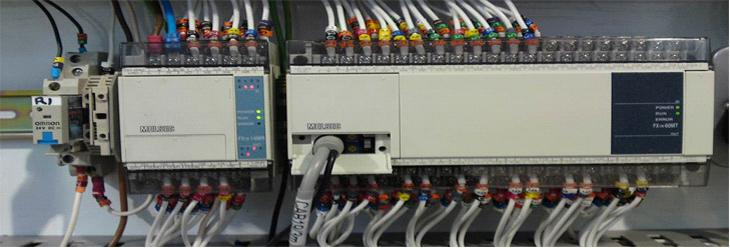

"Supervisory Control And Data Acquisition" kelimelerinin ilk harfleri ile oluşturulan SCADA; “Merkezi Denetleme Kontrol ve Veri Toplama” sistemi olarak adlandırılmaktadır.Scada temel olarak bir yazılımdır. Tek bir cihazdan kullanılabileceği gibi gerekli ağ bağlantıları yapıldıktan sonra bir çok cihazdan kontrol edilip izlenebilir.Scadayı genel olarak Enerji Scadası (Elektrik, Su, Doğalgaz vb.) ve Proses Scadası (Fabrika-tesis otomasyonu vb.) olarak ikiye ayırabiliriz.

Scada sistemleri üç temel bölüme ayrılır:
1. Uzak Uç Birim(Remote Terminal Unit(RTU))
2. Kontrol Merkezi Sistemi(Ana Kontrol Merkezi-Master Terminal Unit(MTU))
3. İletişim Sistemi(iletişim protokolleri)

<h2>İLETİŞİM PROTOKOLLERİ</h2>
Scada sistemlerinde kullanılan bir çok cihazın bilgisayara ve diğer cihazlara bağlanması için EIA standartları olan RS-232,RS-422 ve RS-485 kullanılmaktadır.

<h2>KONTROL BİRİMLERİ</h2>
Ana PLC,yardımcı PLC'ler,elektronik koruma ve kilitleme sistemleri, motor kontrol sistemleri başlıca kontrol birimleridir. En önemli bölüm Ana PLC'dir çünkü bütün sistemi kontrol altında tutar. Ve bu nedenle belli başlı özellikleri olmak zorundadır. Bu özellikler şöyledir;
*   RS-232, RS-485 fiziksel iletişim katmanında, bakır ve fiber optik fiziksel ortamlarda, birden çok protokol ile         haberleşebilmelidir.
*   Kolaylıkla genişleyebilme, konfigüre edilebilme ve bakım yapılabilme özelliğine sahip olmalıdır.
*   Arızalı bir modülü değiştirirken enerjinin kesilmesini gerektirmeyen bir donanım yapısı söz konusu olmalıdır.
*   Birden çok master istasyona ayrı iletişim kanallarından aynı anda konuşabilmelidir.

Scada nedir sorusuna cevap vermiş olduk. Böylelikle asıl sorunun cevabını verme zamanı geldi.
<h2>Neden SCADA kullanmalıyız?</h2>
Scada, en az maliyette daha çok ve daha kaliteli ürün üretmek,insan gücüne bağımlılığı azaltıp can ve mal güvenliğini sağlamak için çok önemli bir araçtır. Yani kısacası minimum maliyetle maksimim verim almayı hedefleyen bir sistemdir. Örneğin kilometrelerce uzakta ki elektrik aktarım hatlarında ki açma-kapama kontrolünü ve hatlarda ki ani yük değişimlerini dengelenmesini,bir arıza oluşumunda en hızlı şekilde müdahale edilmesini sağlar. Böylelikle orada çalışan insanların can güvenliğide sağlanmış olur.

Scada sistemlerinin avantajları şu şekildedir:
1.  Sistemin her an izlenebilmesi
2.  Zaman ve iş gücü kazancı
3.  Üretim verilerinin kayıt ve analiz edebilmesi
4.  Sistemin enerji takibi ve tasarrufu
5.  Cezalı durumları engellemesi (Kompanzasyon vb.)
6.  Sahadaki durumdan haber alınması ve anında müdahale
7.  Sisteme yapılan müdahalelerin kayıt edilmesi
8.  Arıza riski olan bölgelerin tesbit edilebilmesi
9.  Sistemin işleyişi hakkında anında bilgi alınabilmesi (şalterlerin durumu vb.) gibi çok büyük avantajları bulunmaktadır.

Scada sistemlerinin uygulama alanları çok geniştir.Çünkü başka sistemlere de altyapı sağlamaktadır. Örneğin Scada sistemlerine ilave işler eklenerek, Enerji Yönetim Sistemleri (EMS) ve Dağıtım Yönetim Sistemleri(DMS) gibi sistemleri de oluşturabiliriz.

Scada sistemlerinin uygulama alanlarını şu şekilde sıralayabiliriz:
1. Elektrik üretim ve iletim tesisleri
2. Kimya Endüstrisi
3. Doğalgaz ve Petrol boru hatları
4. Su toplama,arıtma ve dağıtma tesisleri
5. Otomativ Endüstrisi
6. Trafik kontrolü
7. Gıda Endüstrisi olmak üzere daha bir çok alanda kullanılabilir.
8. Nükleer Tesisler
9. Sağlık Endüstrisi

Günümüzde bir çok tesis ve işletme Scada sistemine geçiş yapmaya başladı. EPDK(Enerji Piyasası Düzenleme Kurumu) Scada sistemi kullanımını şart koşması ve ileriye dönük bunun planlamasını yapması da gelecekte daha kaliteli tesislerin ve işletmelerin ortaya çıkacağının bir kanıtı olarak gösterilebilir.

Bu yazımda ülkemizde ve dünyada gelişmekte olan sanayi ve endüstri sektörlerinin gözdesi Scada sistemlerini inceledik.Umarım herkes için faydalı bir yazı olmuştur. Bir daha ki yazıda görüşmek üzere...
